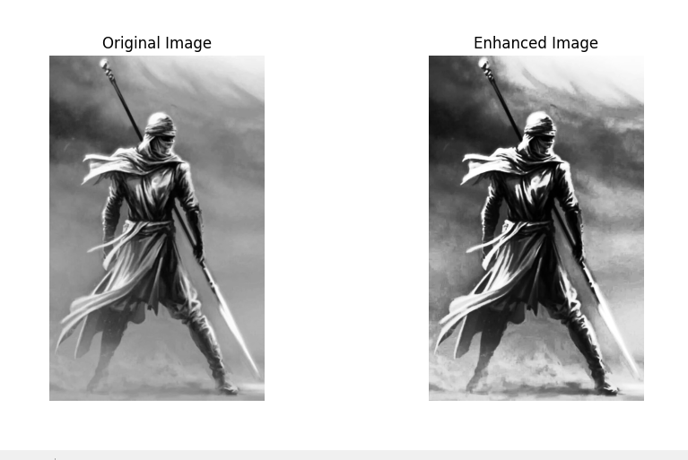

# histogram_equalization
Enhance an image using histogram equalization in Python | computing vision
# Image Enhancement using Histogram Equalization

This Python project enhances the contrast of grayscale images using histogram equalization, a technique to improve image contrast by redistributing the intensity values based on their histogram.

## Features
- Enhances the contrast of grayscale images using OpenCV's histogram equalization.
- Displays the original and enhanced images side by side.
- Saves the enhanced image in the project directory.

## Prerequisites
To run this project, you need to have Python installed along with the following libraries:
- `opencv-python`
- `numpy`
- `matplotlib`

## Installation

1. Clone the repository:
    ```bash
    git clone https://github.com/SalimMessaad1/histogram_equalization.git
    ```

2. Navigate to the project directory:
    ```bash
    cd histogram_equalization
    ```

3. Install the required dependencies:
    ```bash
    pip install -r requirements.txt
    ```

    **Or** manually install the packages:
    ```bash
    pip install opencv-python numpy matplotlib
    ```

## Usage

1. Place your image in the project directory and update the `image_path` in the script.

2. Run the Python script:
    ```bash
    python enhance_image.py
    ```

3. The script will display the original and enhanced images side by side. The enhanced image will also be saved as `enhanced_image.png` in the project directory.

## Example

Original vs. Enhanced image comparison:



and you can see the actual app for it i have made for that porps [Here](https://www.youtube.com/watch?v=GPJ8eXaKjq8)
## Contributing
Feel free to open issues or submit pull requests. Contributions are welcome!

## License
This project is licensed under the MIT License 

